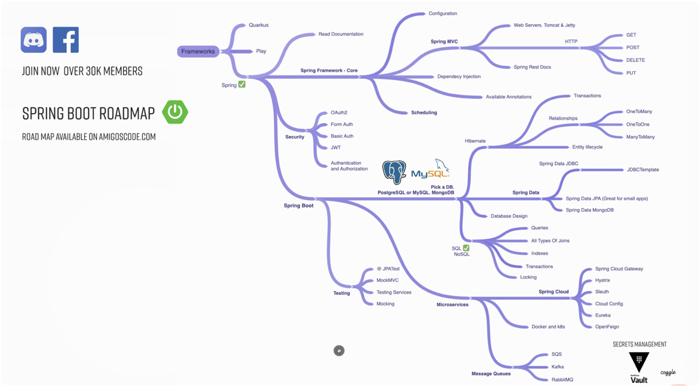

# spring-boot-roadmap
This repo serves as an overview to mastering Spring Boot!

## i. Prerequisites

Contains sections on:
1. Java Core 
2. Databases 
3. Build Tools

Link to Prerequisites and Extra Section: [https://github.com/arsy786/prerequisites-and-extra-tutorials](https://github.com/arsy786/prerequisites-and-extra-tutorials)

## ii. Extra

Contains sections on:
1. Git 
2. Logging/Documentation

Link to Prerequisites and Extra Section: [https://github.com/arsy786/prerequisites-and-extra-tutorials](https://github.com/arsy786/prerequisites-and-extra-tutorials)

## A. Spring Framework (Core)

Contains sections on:
1. Configuration
2. Spring MVC
3. Dependency Injection
4. Available Annotations 
5. Scheduling

Link to Spring Framework Section: [https://github.com/arsy786/spring-framework-tutorials](https://github.com/arsy786/spring-framework-tutorials)

## B. Spring Boot

Contains sections on:
1. Database Selection
2. Hibernate
3. Spring Data
4. Database Design
5. SQL/NoSQL
6. Testing
7. Microservices

Link to Spring Boot Section: [https://github.com/arsy786/spring-boot-tutorials](https://github.com/arsy786/spring-boot-tutorials)

## C. Spring Security

Contains sections on:
1. Authentication and Authorisation
2. Form Auth
3. Basic Auth
4. JWT
5. OAuth2

Link to Spring Security Section: [https://github.com/arsy786/spring-security-tutorials](https://github.com/arsy786/spring-security-tutorials)

## D. Example Projects and Supporting Materials

| <ins>Example Projects | 
|------|
| [Spring Boot Best Practices](https://github.com/arsy786/springboot-best-practices)|
| [Spring Boot MongoDB REST API (Simple)](https://github.com/arsy786/spring-boot-mongodb-rest-api)| 
| [Football Club Management System (Advanced)](https://github.com/arsy786/football-club-management-system)|
| [Spring Boot Microservices](https://github.com/arsy786/spring-boot-microservices-new)| 
| [Spring Security Tutorials](https://github.com/arsy786/spring-security-tutorials)|

| <ins>Supporting Materials | 
|------|
| [Java Core Guide (PDF)](https://github.com/arsy786/prerequisites-and-extra-tutorials/blob/main/Java_QuickReference_v1.1.pdf)| 
| [SQL Cheat Sheet (PDF)](https://github.com/arsy786/prerequisites-and-extra-tutorials/blob/main/sql-basics-cheat-sheet-ledger.pdf)|
| [MongoDB Cheat Sheet (PDF)](https://github.com/arsy786/prerequisites-and-extra-tutorials/blob/main/MongoDB-Dark.pdf)| 
| [Bash Cheat Sheet (GitHub)](https://github.com/RehanSaeed/Bash-Cheat-Sheet)|
| [Git Cheat Sheet (PDF)](https://github.com/arsy786/prerequisites-and-extra-tutorials/blob/main/git-cheat-sheet.pdf)|
| [Docker Cheat Sheet (PDF)](https://github.com/arsy786/spring-boot-microservices-new/blob/master/docker_cheatsheet.pdf)| 
| [Kubectl Cheat Sheet (PDF)](https://github.com/arsy786/spring-boot-microservices-new/blob/master/Kubernetes-Cheat-Sheet.pdf)|

